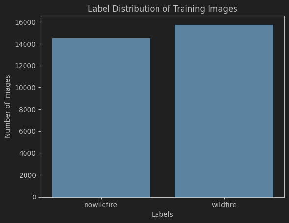
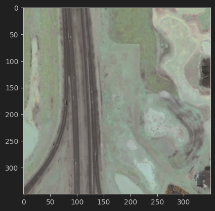
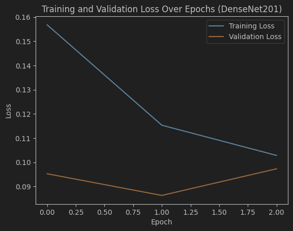

# Wildfire Classification from Satellite Images
Implemented a CNN-based classification system for over 40,000 satellite images. Built and trained DenseNet model for wildfire prediction by achieving 97% accuracy.

## Exploratory
+ Number of no wildfire images : 14500 images
+ Number of wildfire images : 15750 images
```
def exploratory(directory):

    labels = os.listdir(directory)

    label_counts = Counter()
    for label in labels:
        label_path = os.path.join(directory, label)
        label_counts[label] = len(os.listdir(label_path))

    print("Number of no wildfire images : " + str(label_counts["nowildfire"]))
    print("Number of wildfire images : " + str(label_counts["wildfire"]))

    # Plot the distribution
    plt.bar(label_counts.keys(), label_counts.values())
    plt.xlabel('Labels')
    plt.ylabel('Number of Images')
    plt.title('Label Distribution of Training Images')
    plt.show()

```
```
exploratory(train_data_dir)
```



## Data Preprocessing
Preprocessed images  using multiple image preprocessing techniques including colour adjustment, increasing sharpness, median filtering, and contrast enhancement.
```
def color_adjustment(image, brightness_range=(-50, 50)):
    brightness = random.randint(brightness_range[0], brightness_range[1])
    adjusted_image = np.clip(image.astype(np.int16) + brightness, 0, 255).astype(np.uint8)
    return adjusted_image

def increase_sharpness(image):
    kernel = np.array([[-1,-1,-1], [-1,9,-1], [-1,-1,-1]], dtype=np.float32)  # Sharpening kernel
    sharpened_image = cv2.filter2D(image, -1, kernel)
    return sharpened_image

def median_filtering(image):
    # Separate color channels
    red_channel = image[:, :, 0]
    green_channel = image[:, :, 1]
    blue_channel = image[:, :, 2]

    # Apply median filtering to each channel
    filtered_red_channel = medfilt2d(red_channel, kernel_size=3)
    filtered_green_channel = medfilt2d(green_channel, kernel_size=3)
    filtered_blue_channel = medfilt2d(blue_channel, kernel_size=3)

    # Combine filtered channels back into an image
    filtered_image_array = np.stack((filtered_red_channel, filtered_green_channel, filtered_blue_channel), axis=-1)

    return filtered_image_array

#contrast enhancement
def contrast_enhancement(image):
    # Convert image to HSV color space
    hsv = cv2.cvtColor(image.astype(np.uint8), cv2.COLOR_BGR2HSV)  # Cast for OpenCV

    # Split channels (Hue, Saturation, Value)
    h, s, v = cv2.split(hsv)

    # Equalize the value channel
    v_eq = cv2.equalizeHist(v)

    # Combine channels back to HSV
    hsv_equalized = cv2.merge((h, s, v_eq))

    # Convert back to RGB
    image_equalized = cv2.cvtColor(hsv_equalized, cv2.COLOR_HSV2BGR)

    return image_equalized
``` 
``` 
image_array = np.array(image)
preprocessing_img = contrast_enhancement(increase_sharpness(median_filtering(color_adjustment(image_array))))

plt.imshow(preprocessing_img)
``` 
Before Preprocessing



After Preprocessing


### Training

Train the model using DenseNet201 as the base model and add the last layer with one neuron unit and activation Sigmoid for binary classification (Wildfire/ No wildfire).

```
base_model = DenseNet201(weights='imagenet', include_top=False, input_shape=(224, 224, 3))

# Add custom classification layers
x = base_model.output
x = GlobalAveragePooling2D()(x)
x = Dense(512, activation='relu')(x)
predictions = Dense(1, activation='sigmoid')(x)  # number of classes

# Create the model
model = Model(inputs=base_model.input, outputs=predictions)

# Freeze the layers of the pre-trained base model
for layer in base_model.layers:
    layer.trainable = False

# Compile the model
model.compile(optimizer='adam', loss='binary_crossentropy', metrics=['accuracy'])
```


## Evaluation
```
preds = model.predict(test_generator)  
test_loss, test_acc = model.evaluate(test_generator) 
print('\nTest Loss: ', test_loss)
print('\nTest Accuracy: ', np.round(test_acc * 100), '%')
```
Test Loss:  0.087

Test Accuracy:  97.0 %

## Prediction
```
def get_prediction(model_name, image):
    if model_name == "DenseNet201":
        base_model = DenseNet201(weights='imagenet', include_top=False, input_shape=(224, 224, 3))
        # Add custom classification layers
        x = base_model.output
        x = GlobalAveragePooling2D()(x)
        x = Dense(512, activation='relu')(x)
        predictions = Dense(1, activation='sigmoid')(x)  # number of classes
        # Create the model
        model = Model(inputs=base_model.input, outputs=predictions)
        model.load_weights('best_model_densenet201.h5')
        
    pred_prob = model.predict(image) 

    if pred_prob >= 0.5:
        prediction_result = "WildFire"
    else:
        prediction_result = "No WildFire"

    return pred_prob[0][0], prediction_result
```
```
prob, result = get_prediction("DenseNet201",img_data_batch)

print("The probability is ", prob)
print("The classification result is ", result)
```

The probability is  6.792417e-05

The classification result is  No WildFire
